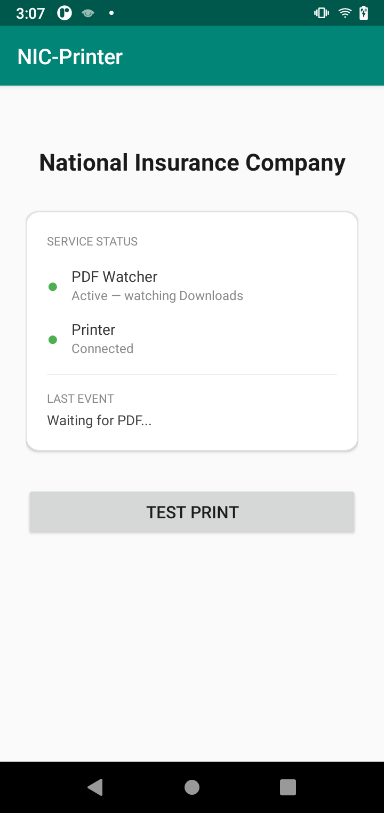

 # NIC-Printer — Automated Receipt Printing for Sunmi Thermal Devices
                                                                                                                                                                                                                                               ## Overview
  Android application built for Sunmi V2 Plus devices (Android POS with built-in thermal printer) that automates receipt printing triggered by downloads from a web workflow — requiring zero technical knowledge from end users.

  **Devices:** Sunmi V2 Plus (built-in 58mm thermal printer)
  **Users:** 13 employees across 13 departments
  **Stack:** Android (Java/Kotlin) · Sunmi Printer SDK · Android PdfRenderer
  **Deployment:** APK sideloaded via ADB to managed Sunmi devices

  ---

  ## Problem

  Organization needed to issue digital receipts to customers instead of handwriting on blank paper. Solution evaluated: tablet + standalone thermal printer — cost prohibited for multi-branch deployment.

  **Alternative chosen:** Sunmi V2 Plus — all-in-one Android POS device with built-in thermal printer at fraction of the cost.

  **New problem:** Sunmi thermal printing API is developer-facing. Non-IT employees cannot:
  - Locate downloaded PDFs manually
  - Navigate Sunmi printer settings
  - Achieve consistent print quality/formatting
  - Remember to delete files (storage fills up on small internal storage)

  Additionally: **Sunmi devices do not natively render PDFs** — raw PDF cannot be sent to the thermal printer SDK directly.

  ---

  ## Solution

  Background service that silently monitors the downloads folder. Employee workflow requires zero extra steps beyond what they already do:

  ```
  Employee logs into APEX workflow
           │
           ▼
  Clicks receipt → PDF downloads automatically
           │
           ▼  (FileObserver detects new .pdf in /Downloads)
           │
           ▼
  App converts PDF → Bitmap (Android PdfRenderer)
           │
           ▼
  Prints via Sunmi InnerPrinter SDK — formatted for 58mm roll
           │
           ▼
  Waits 10 seconds → prints second copy (customer + company copy)
           │
           ▼
  Deletes PDF → storage freed automatically
  ```

  ---

  ## How It Works

  ### Background File Watcher
  Uses Android `FileObserver` to watch `/storage/emulated/0/Download/` for `CREATE` events matching `*.pdf`.

  ```java
  FileObserver observer = new FileObserver(downloadsPath, FileObserver.CREATE) {
      @Override
      public void onEvent(int event, String fileName) {
          if (fileName != null && fileName.endsWith(".pdf")) {
              handleNewPdf(new File(downloadsPath, fileName));
          }
      }
  };
  ```

  ### PDF to Bitmap Conversion
  Sunmi thermal SDK accepts `Bitmap`, not PDF. Android's built-in `PdfRenderer` converts each page:

  ```java
  PdfRenderer renderer = new PdfRenderer(
      ParcelFileDescriptor.open(pdfFile, ParcelFileDescriptor.MODE_READ_ONLY)
  );
  PdfRenderer.Page page = renderer.openPage(0);
  Bitmap bitmap = Bitmap.createBitmap(
      THERMAL_PRINT_WIDTH_PX,
      (int)(page.getHeight() * THERMAL_PRINT_WIDTH_PX / page.getWidth()),
      Bitmap.Config.ARGB_8888
  );
  page.render(bitmap, null, null, PdfRenderer.Page.RENDER_MODE_FOR_PRINT);
  ```

  ### Thermal Print via Sunmi SDK
  ```java
  SunmiPrintHelper.getInstance().printBitmap(bitmap, callback);
  ```

  ### Duplicate Copy + Cleanup
  ```java
  printReceipt(bitmap);
  new Handler().postDelayed(() -> {
      printReceipt(bitmap);         // second copy after 10 seconds
      pdfFile.delete();             // cleanup
  }, 10_000);
  ```

  ---

  ## User Experience

  | Before | After |
  |--------|-------|
  | Employee downloads PDF, manually navigates to print | Employee clicks receipt in browser — done |
  | Inconsistent print quality | Optimized bitmap rendering for 58mm thermal |
  | Files accumulate on device storage | Auto-deleted after printing |
  | IT needed for every print issue | Zero IT intervention required |

  - Average time from download to first print: ~3 seconds
  - Zero storage accumulation — device storage stays clean
  - Zero training required — existing APEX workflow unchanged

  ---

  ## Technical Challenges

  **PDF rendering width:** 58mm thermal roll = 384px at 203dpi. Bitmap must be resized to exactly this width or print output is cut off or distorted. Solution: calculate height proportionally, resize before sending to SDK.

  **File write timing:** `FileObserver` fires on file create, but download may not be complete yet. Solution: brief delay + file size stability check before opening `PdfRenderer`.

  **Foreground service requirement:** Android 8+ kills background services aggressively. App runs as a foreground service with a persistent notification to survive backgrounding.

  ---

  ## Deployment

  ```bash
  # Sideload to Sunmi device via ADB
  adb install nic-printer.apk

  # Grant storage permissions
  adb shell pm grant com.nic.printer android.permission.READ_EXTERNAL_STORAGE
  adb shell pm grant com.nic.printer android.permission.WRITE_EXTERNAL_STORAGE

  # Set as autostart on boot via device owner policy or Sunmi MDM
  ```

  ---

  ## Stack
  - **Language:** Java / Kotlin (Android)
  - **Printer SDK:** Sunmi InnerPrinter SDK
  - **PDF rendering:** Android `PdfRenderer` (API 21+)
  - **File monitoring:** Android `FileObserver`
  - **Min SDK:** Android 8.0 (API 26) — matches Sunmi V2 Plus OS


 ## Screenshots

  
  ---
